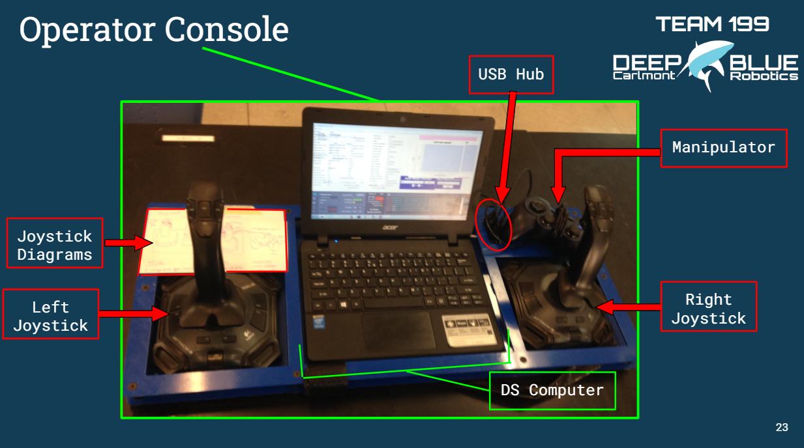
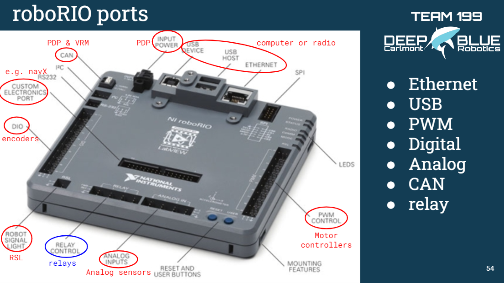
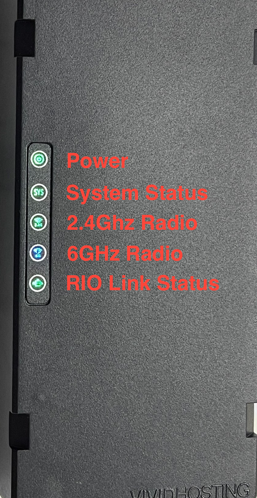
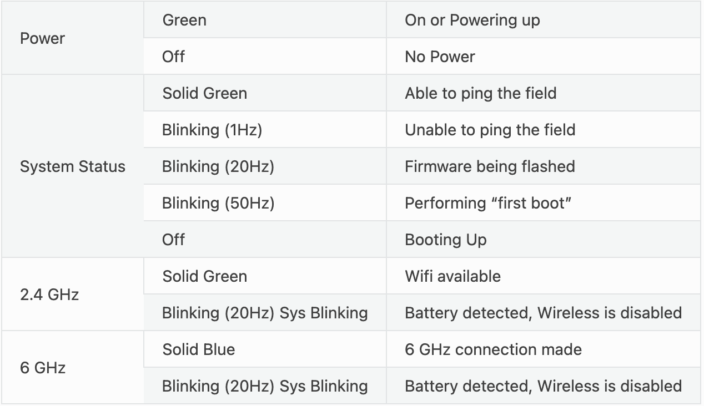
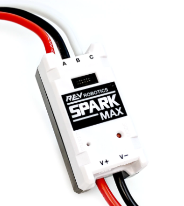
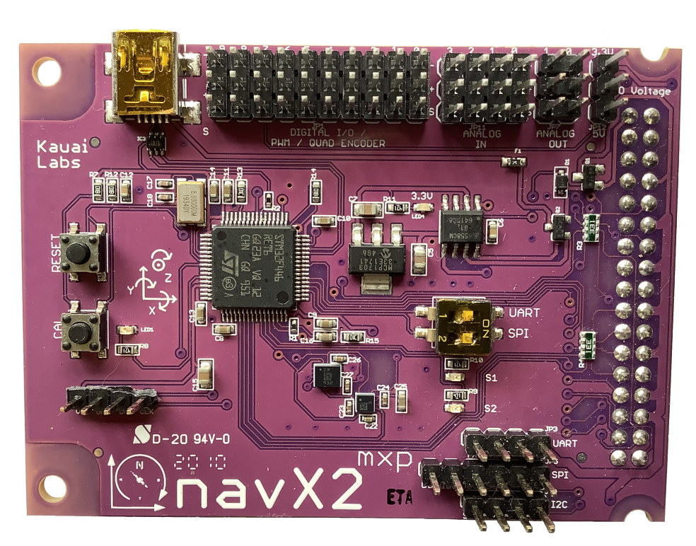

# Electronics

We have significant overlap with senac training. If you want more details on senac components you can go through [their Electronics presentation](https://docs.google.com/presentation/d/1Y2GSd2B3aV2_6J5xKNS-_xWRiGW_daArdgr4zasUuno/edit#slide=id.g253cb92c37_0_37). Here, we will cover the parts relevant to programming.

### Operator Console and Communication
- We use a computer, joysticks, xbox controllers, etc
- We have one driver who operates the drivetrain, and another "manipulator" who controls all the other subsystems

- The RoboRIO is the "brain" of the robot and runs our robot code.
    - Can plug sensors and add-ons onto it
    - Can add micro-controllers such as a Raspberry Pi to connect to other devices
    - 
- The radio is what we use to communicate between the robot and the driverstation computer. 
    - Connects to the DS Computer via Wifi, Ethernet, or USB
    - {: style="width: 22.5%"} {: style="width: 75.5%"} 
- The Power Distribution Panel (PDP) / Power Distribution Hub (PDH) gives power to the electrical components.

### Motors and Motor Controllers
- Motor controllers control the motors and communicate with the RoboRIO.
    - The code only controls the motor controllers, which then control the motors. (Code does not control motors directly)
- Different types of motors have different power and respective motor controllers
- Gears and planetary gearboxes can be used to make the motor turn with more torque or turn faster
- The motors we use are:
    - NEO
        - We almost exclusively use these
        - Versatile
        - Encoders are built into these
        - Used for drivetrains and other subsystems which require a lot of torque
    - NEO Vortex
        - Very similar to normal NEOs
        - Motor controller attaches directly to the motor instead of using cables
    - NEO 550
        - We usually don't use these
        - Small
        - Used for subsystems other than drivetrains
- The motor controllers we typically use are:
    - SparkMaxes
    - SparkFlexes

### Sensors
- Encoders
    - Attached to motor or built into motor
    - Record how much a motor has spun or its position
        - Can find RPM, distance spun, etc
- navX
    - Measures the angle turned for the robot
- Limelight
    - Vision Tracking System
    - Tracks retroreflective tape
    - More details in the advanced programming section
