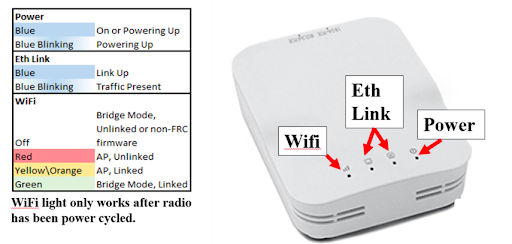

# Electronics

We have significant overlap with SenAct training. If you want more details on SenAct components you can go through [their Electronics presentation](https://docs.google.com/presentation/d/1Y2GSd2B3aV2_6J5xKNS-_xWRiGW_daArdgr4zasUuno/edit#slide=id.g253cb92c37_0_37). Here, we will cover the parts relevant to programming.

### Operator Console and Communication
- We use a computer, joysticks, xbox controllers, etc
- We have one driver who operates the drivetrain, and another "manipulator" who controls all the other subsystems

- The RoboRIO is the "brain" of the robot and runs our robot code.
    - Can plug sensors and add-ons onto it
    - Can add micro-controllers such as a Raspberry Pi to make it run faster
    - 
- The radio is what we use to communicate between the robot and the driver station computer. 
    - Connects to the DS Computer via Wifi or Ethernet
    - 
- The PDP gives power to the electrical components. 

### Motors and Motor Controllers
- Motor controllers control the motors and communicate with the RoboRIO.
    - The code only controls the motor controllers, which then control the motors. (Code does not control motors directly)
- Different types of motors have different power and respective motor controllers
- Gears and planetary gearboxes can be used to make the motor turn with more torque or turn faster
- The motors we use are:
    - CIM
        - Biggest
        - Most powerful
        - Used for drivetrains
    - Mini CIMs
        - Medium size
    - BAG
        - Smallest
    - NEO
        - Encoders are built into these
        - Comparable to CIMs
        - Used for drivetrains
    - NEO 550
        - Small
        - Used for subsystems other than drivetrains
- The typically motor controllers we use are:
    - CANSparkMaxes
    - Talons

### Sensors
- Encoders
    - Attached to motor or built into motor
    - Record how much a motor has spun
        - Can find RPM, distance spun, etc
- navX
    - Measures the angle turned for the robot
- Limelight
    - Vision Tracking System
    - Tracks retroreflective tape
    - More details in the advanced programming section
