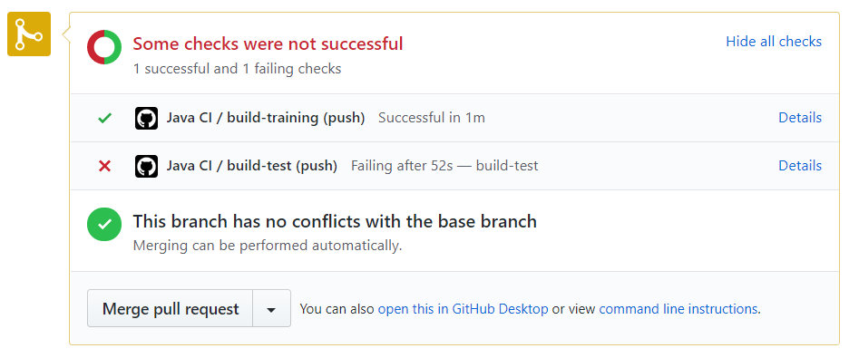

Continuous Integration (or CI), is what we use to automatically test our code. This is particularly useful to make sure that code in a Pull Request works. 

When you submit a pull request, you will see something like this at the bottom of the PR (hopefully it will be all green though):

Typically, we will only merge code into the `dev` or `master` branches if they successfully build and pass tests, so make sure to build your code before you push it!