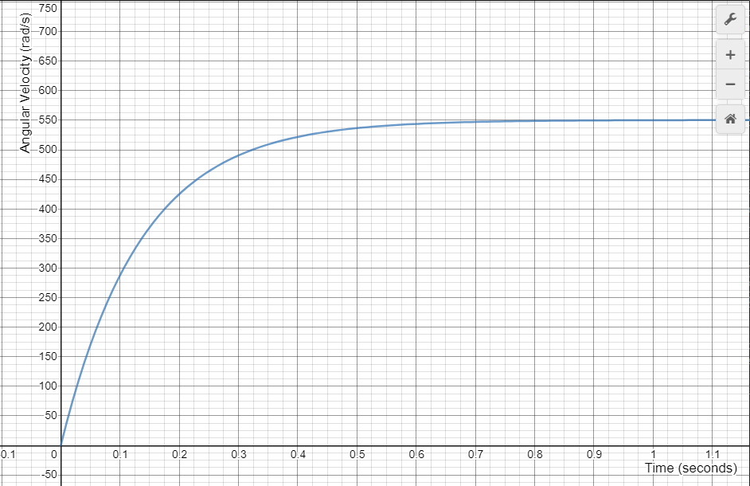

## Introduction
This section covers a control method known as Drivetrain Characterization, as described in [this](https://drive.google.com/drive/folders/14UI1WPtFT9KvKjAHt90VEv66ovQtFDvc) paper. In this section, we will develop the Drivetrain Characterization formula along with various tests to determine the constants needed to make the formula work.

## Developing the Drivetrain Characterization Formula
Our previous method for driving the robot used the joystick values as a percentage of the maximum voltage we want to supply to the motors. But, let's say we wanted a more accurate control method - one based on math and physics. Drivetrain Characterization allows us to more accurately determine the voltage we should supply given a desired velocity and acceleration. This section will require an understanding of the concepts described in [Part 1](https://docs.google.com/presentation/d/14PnR4rYJ5rdAwwJBectMS4YYf6jHjcI0Y-uhp9_ridM/edit#slide=id.g253f61fe15_3_0) and [Part 2](https://docs.google.com/presentation/d/1bMCfHxcyumRmsPNsWSuRBEDfwZfm4lxp9J-wn77V3Ao/edit) of our basic electronic theory presentation.

Brushed DC motors work by running current through a coil of copper wires (known as the windings of the motor) as shown in the figure below. When current passes through these windings, a temporary magnetic field is created. Since there are permanent magnets in the motor, the armature (the part in the center connected to the coil of wires that is allowed to rotate) begins to accelerate towards the magnets (the north end of the armature is attracted to the positive end and the south end is attracted to the negative end). As well, when the armature's acceleration becomes zero, the flow of current reverses and the north end of the armature rotates towards the positive end and the south end rotates towards the negative end. This process repeats as long as there is voltage across the motor.

But what prevents the motor from accelerating indefinitely? Well, just as current running through the motor causes the armature to spin, spinning the armature generates current. So, while the motor is spinning, a force, known as the counter electromotive force (or back-EMF), restricts the flow of current. Eventually, back-EMF will cancel out the torque generated by the windings and the rotational speed of the motor will reach a constant value.

Kirchhoff's voltage law states that the sum of the voltages in any closed loop in a circuit is zero. There are three voltages: a voltage we wish to apply \(V_{app}\), a voltage drop across the windings \(V_{windings}\), and a voltage drop due to back-EMF \(V_{emf}\). If we apply Kirchhoff's voltage law, we get:

\[V_{app} - V_{emf} - V_{windings} = 0\]

Which, by solving for \(V_{app}\), becomes:

\[V_{app} = V_{emf} + V_{windings}\]

!!! note
    It is known that \(V_{windings} = IR\) where \(I\) is the current and \(R\) is the resistance and \(I \propto \tau\) where \(\tau\) is the motor torque. Additionally \(V_{emf} \propto \omega\) where \(\omega\) is the rotational speed of the motor. Since \(\tau \propto \frac{d\omega}{dt}\),
    we can create an equation for \(\omega(t)\):
        \[V_{app} = a\frac{d\omega}{dt} + b\omega(t)\]
    where \(a\) and \(b\) are constants. For those who are inclined to do some calculus, you can find an equation relating rotational speed with time. The behavior of this function should match the behavior described above.

The voltage due to back-EMF varies directly with the speed of the wheels and therefore varies directly with the speed of the drivetrain, or \(V_{emf} = k_v * \text{velocity}\). The voltage across the windings causes torque, which is proportional to the acceleration of the wheels and therefore the acceleration of the drivetrain, meaning \(V_{windings} = k_a * \text{acceleration}\). Finally, we need to account for any resistance we encounter in trying to move, such as friction. It so happens that this resistance is constant no matter the deisred velocity and acceleration. All that needs to be done is add a third constant - let's call it \(k_{volt}\) (other sources may call it \(k_S\)). Our new formula becomes:

\[V_{app} = k_{volt} + k_v * \text{velocity} + k_a * \text{acceleration}\]

!!! note
    The techniques described in this section can be used to determine formulas for efficiently controlling subsystems other than drivetrains, such as robot arms, elevators, or flywheel shooters. In the case of other subsytems, determine the forces going against your system and include them in your equation. In most cases, the equation will take the form of some constant plus a velocity term and an acceleration term. However, some systems may need to add additional terms to counteract gravity, such as in elevator control
    
    \[V_{app} = k_g + k_{volt} + k_v * \text{velocity} + k_a * \text{acceleration}\] 
    
    or arm control 
    
    \[V_{app} = k_{volt} + k_{g} * \cos({\text{angular position}}) + k_v * \text{angular velocity} + k_a * \text{angular acceleration}\].

This is the drivetrain characterization formula. In practice, however, we apply the drivetrain characterization formula to each side of the drivetrain and for each direction. That means we need equations for the left and right of the drivetrain and for each direction (wheels moving forward/backward).

\[V_{\text{fl app}} = k_{\text{fl volt}} + k_{\text{fl v}} * \text{fl velocity} + k_{\text{fl a}} * \text{fl acceleration}\]

\[V_{\text{fr app}} = k_{\text{fr volt}} + k_{\text{fr v}} * \text{fl velocity} + k_{\text{fr a}} * \text{fr acceleration}\]

\[V_{\text{bl app}} = k_{\text{bl volt}} + k_{\text{bl v}} * \text{bl velocity} + k_{\text{bl a}} * \text{bl acceleration}\]

\[V_{\text{br app}} = k_{\text{br volt}} + k_{\text{br v}} * \text{fl velocity} + k_{\text{br a}} * \text{br acceleration}\]

That's a lot of math!

## Determining the Constants
To determine the drivetrain characterization constants \(k_{volt}\), \(k_{v}\), and \(k_{a}\), we must isolate each dependent variable and gather data. We can then analyze the data using regression analysis (determining the best-fit line).

A situation in which velocity changes, but acceleration is constant, is one in which the applied voltage increases linearly; we call this behavior "quasistatic". The robot's acceleration is most pronounced when the voltage changes from a small value to a large value in a short period of time; we call this behavior "dynamic".

For the tests, we record the voltage applied to each side of the drivetrain and measure the velocity and acceleration for each side. As well, we repeat each test twice: one for moving straight forwards, another for moving straight backwards. Once we have collected the data, we can perform ordinary least squares regression to determine the constants.

This sounds like a lot of work to implement and, luckily enough, WPILib has a tool that greatly simplifies our work. You can check out instructions for using the tool [here](https://docs.wpilib.org/en/latest/docs/software/wpilib-tools/robot-characterization/introduction.html#prerequisites).

## Implementing Drivetrain Characterization

You will need to initialize six objects: 1 [`SimpleMotorFeedforward`](https://first.wpi.edu/FRC/roborio/release/docs/java/edu/wpi/first/wpilibj/controller/SimpleMotorFeedforward.html) objects for each side and direction (4 total), and 1 [`PIDController`](https://first.wpi.edu/FRC/roborio/release/docs/java/edu/wpi/first/wpilibj/controller/PIDController.html) for each side. The constructor for each `SimpleMotorFeedforward` will require the kS, kV, and kA we found in the previous section and each `PIDController` will require the kP (and possibly kD) from the previous section.

Our characterized driving code will require two parameters: left and right, the desired speed of the wheels in m/s for the left and right sides. The code will then supply the motors with the correct voltage. Below are the instructions for creating our characterized driving code:

1. For the left and right sides, determine the desired acceleration of the robot by finding the change in velocity between our desired velocity and our current velocity and dividing by the change in time between the two measurements.

2. (Optional) Clip the acceleration at some maximum value. Note that the maximum acceleration the robot can achieve without the wheel slipping is \(\mu_s g\) where \(\mu_s\) is the coefficient of static friction and \(g\) is the gravitational acceleration.

3. Apply the drivetrain characterization formula for each side and direction using the [`SimpleMotorFeedforward.calculate()`](https://first.wpi.edu/FRC/roborio/release/docs/java/edu/wpi/first/wpilibj/controller/SimpleMotorFeedforward.html#calculate(double,double)) method.

4. Determine the adjustment value for each side using the [`PIDController.calculate()`](https://first.wpi.edu/FRC/roborio/release/docs/java/edu/wpi/first/wpilibj/controller/PIDController.html#calculate(double)) method.

5. If the robot is moving forward on the left side, the desired voltage is the sum of the left PID output and the forward left FF output; otherwise, the voltage is the sum of the left PID output and the backward left FF output; otherwise, the voltage. Repeat for the right side.

6. Divide by the maximum voltage and supply the final results to your drivetrain's `tankDrive()` method.

You should now have everything you need to implement your own code for a characterized drivetrain.