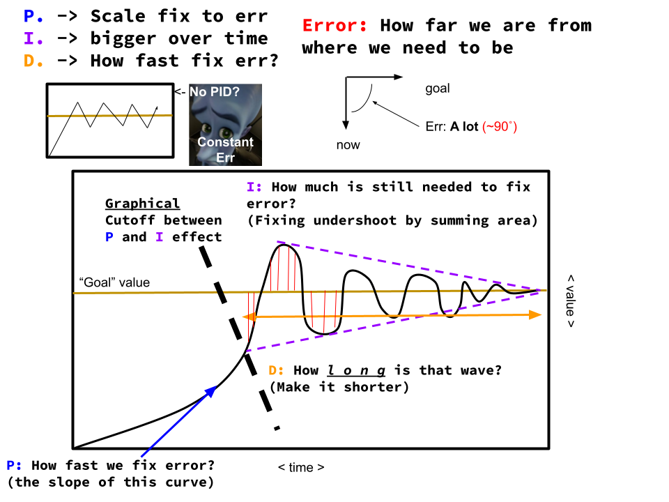
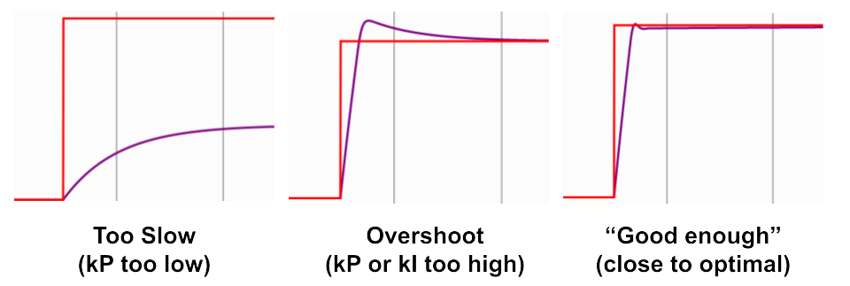

<script
  src="https://cdn.mathjax.org/mathjax/latest/MathJax.js?config=TeX-AMS-MML_HTMLorMML"
  type="text/javascript">
</script>

## Feedback Control: PID Algorithm
PID (Proportional Integral Derivative) control is a method that issue corrective commands to move a mechanism from where it actually is, to where you want it to be using sensors that detect the difference between the two states. WPILIB and vendor libraries usually have PID implemented with a few additional features. We will first cover the underlying theory, then the implementation.
## Theory
Here is an intuitive explanation of PID:
<iframe width="640" height="360" src="https://www.youtube.com/embed/wkfEZmsQqiA" title="What Is PID Control? | Understanding PID Control, Part 1" frameborder="0" allow="accelerometer; autoplay; clipboard-write; encrypted-media; gyroscope; picture-in-picture; web-share" allowfullscreen></iframe>

As a summary, the controller has 3 parts:

- kP (Proportional term): drives the position error to zero by contributing to the control signal proportionally to the current position error

- kI (Integral term): drives the total accumulated error to zero by contributing to the control signal proportionally to the sum of all past errors

- kD (Derivative term): drive the change of the error to zero by contributing to the control signal proportionally to the change of the error

The three quantities are added together to drive the error to zero. The three constants can be "tuned" (by changing around their values) for the error to be driven faster, slower, or to be less volatile.

In code, it looks something like this:
``` Java

// kP, kI, kD can be any value, for example kP can = 0.5
// You "tune" these values by finding the optimal value
double kP = 0.2;
double kI = 0.01;
double kD = 0.05;

double lastTimestamp = Timer.getFPGATimestamp();
double accumulatedError = 0; // for the kI term
double previousError = 0; // for the kD term

// runs every 20 ms
@Override
void periodic() {
    double targetAltitude = 100;
    drone.fly(calculate(drone.getAltitude(), targetAltitude))
}

/* calculates the output of the PID controller given the error (input) */
double calculate(double currentPosition, double targetPosition) {
    double error = targetPosition - currentPosition;
    double currentTimestamp = Timer.getFPGATimestamp();
    // amount of time that passed since the last time the controller was run
    double deltaTime = currentTimestamp - lastTimestamp;
    accumulatedError += kI * error * deltaTime
    double derivative = (error - previousError) / deltaTime;

    // update values for next time this method is called
    lastTimestamp = currentTimestamp;
    previousError = error;

    return kP * error + accumulatedError + kD * derivative;
}
```

For those that know calculus, the formal definition of PID control is:

$$ u(t) = K_{p}e(t) + \int_{0}^{t}e(\tau)d\tau + K_{d}\frac{de}{dt} $$

where u(t) is the control effort (amount of feedback at time t), e(t) is the error at current time t, and \\(\tau\\) is the integration variable. Do not worry about the formula as long as you understand the video and how the code works.

### **PID in a nutshell:**

(I'm too lazy to draw all the red lines representing kI)

If you want more details, WPIlib has an [article of PID](https://docs.wpilib.org/en/stable/docs/software/advanced-control/introduction/introduction-to-pid.html).

## Tuning
How do you find kP, kI, and kD? What are the optimal values of these constants? What is optimal?

In general, the "optimal" PID controller gets the error to zero as fast as possible, while not overshooting or oscillating. For the following graphs, the red line represents the target/goal while the purple line represents the current position. With the ideal constants, you should get close to the 3rd graph.



To get those ideal constants... you kind of just guess and check. WPILIB provides a nice simulation of how it is like to tune these constants.
### [Click here to try tuning a PID Controller](https://docs.wpilib.org/en/stable/docs/software/advanced-controls/introduction/tuning-flywheel.html)
Scroll until you get to "Pure Feedback Control". Follow the instructions and see if you can get the optimal tuning solution. **DO NOT SKIP THIS PRACTICE**

## Other constants/terms

### kIz or "I-Zone"
Sometimes, the I term can accumulate error very fast and overshoot the target. In that case, we only want the I term to be accumulating error when the error is smaller than a certain threshold. The "I-Zone", typically denoted as kIz, lets you set that threshold.

!!! warning
    Generally, it is discouraged to use the I term because it is easy for the mechanism to overshoot. Feedforward should be used instead of the I term. We will explain why in the Feedforward section.

### kF or "Feed-Forward Gain"
This is a sneak peek to what will be discussed in the Feedforward section, but given the target, what is the estimated motor output necessary to get to the target? Say for example we need get a motor to a certain velocity. It probably needs a set amount of voltage to get to that speed, so we should just add it. Note that this is different from kP since kP contributes proportionally to the error, not the target. kF is usually only used for velocity or current (draw) closed loop control, and even then not really used most of the time. The content discussed in the Feed-forward section essentially does what kF does, but better. However, sometimes you will see this constant in other documentation so it is nice to know what it is.

### kMaxOutput, kMinOutput
Should be self-explanatory, used to make sure you don't give your mechanism too much power

### `setReference()`, `setSetpoint()`, etc
There are many names for "target", such as "reference", "setpoint", and more. When tuned properly, after you set the target the motor should drive to the setpoint.

There are many other methods and configurations that are used to PID control which you can find in the documentation. 

## Implementation
You remember the code used to implement PID shown near the beginning of this page? Often, one does not need to implement PID Control from the ground-up. WPILIB and many motor controllers have PID controllers built into the class. All that needs to be done is set the setpoint, kP, kI, and kD (as well as other configurations that you may want). 

!!! warning
    Ever since the last time this website was updated (2024), the team has not used motors from the CTRE Phoenix API. The information regarding the PID implementation of the CTRE Phoenix motors may be outdated. However, SparkMaxes and other motors should be updated.

For example, all [`BaseMotorControllers`](https://www.ctr-electronics.com/downloads/api/cpp/html classctre_1_1phoenix_1_1motorcontrol_1_1can_1_1_base_motor_controller.html) in the CTRE Phoenix API (Talon_SRX and Victor_SPX) can do PID as follows:

``` Java
// Config
motor.config_kP(0, kP);
motor.config_kI(0, kI);
motor.config_kD(0, kD);
// Tell the PID loop how close we want to get to the setpoint in sensor units
motor.configAllowableClosedloopError(0, closeness);
// Tell the PID loop which sensor to use. In this case use a quadrature encoder 
motor.configSelectedFeedbackSensor(FeedbackDevice.QuadEncoder);
// Move to 0 on the selected sensor
motor.set(ControlMode.Position, 0);
```

And for SparkMax, SparkFlex, or other Rev motor controllers, we use the [`SparkPIDController`](https://codedocs.revrobotics.com/java/com/revrobotics/sparkpidcontroller) (Take a look at the javadocs). Notice how there are other methods that let you control the velocity, acceleration, setting target, and more:
``` Java
CANPIDController pidController = motor.getPIDController();
// Config
pidController.setOutputRange(-1.0, 1.0);
pidController.setP(kP, 0);
pidController.setI(kI, 0);
pidController.setD(kD, 0);
// Tell the PID loop how close we want to get to the setpoint in rotations
pidController.setSmartMotionAllowedClosedLoopError​(closeness, 0);

// Move to 0 on the quadrature encoder
pidController.setReference​(0.0, ControlType.kPosition, 0)
```

For general purposes, you can use WPILIB's [`PIDController`](https://github.wpilib.org/allwpilib/docs/release/java/edu/wpi/first/math/controller/PIDController.html) class:
``` Java
PIDController pidController = new PIDController(kP, kI, kD);
pidController.setSetpoint(0);
// Tell the PID loop how close we want to get to the setpoint in rotations
pidController.setTolerance(closeness);

// This code is assumed to be in a method or command called frequently.
double state;
if (!pidController.atSetpoint()) {
    // getError() and update() are not actual functions. They are placeholders for your own code.
    // Get the current state of what is being controlled
    error = getError(); 
    // Do something with the adjustment
    update(pidController.calculate(error));
}
// Only use this line once the error is "close enough"
pidController.reset();
```

You need to check out the documentation for each of these classes and familiarize youself with them.

# Conclusion
Thankfully, most of the math is handled by WPIlib or motor controller firmware. However, it is important to understand what is actually happening so that you can properly tune your control loops.

But PID is just the beginning. There are many more complicated and more powerful control methods built upon PID that will be discussed later in this section, including Following Trajectories using PathPlanner and Drivetrain Characterization. In addition, PID is often not enough to properly control a mechanism, feedforward algorithms are also needed...

## Additional materials
[This YouTube playlist explains in more detail of how PID works. Not required but highly recommended](https://www.youtube.com/watch?v=wkfEZmsQqiA&list=PLn8PRpmsu08pQBgjxYFXSsODEF3Jqmm-y)

***

> **xkcd #689: FIRST Design**
> 
> 
> 
> You might use PID to control the elevator.
>
> _<https://xkcd.com/689/>_