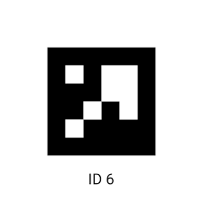
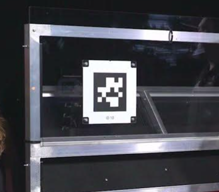

## What is a Limelight?
A [Limelight](https://andymark-weblinc.netdna-ssl.com/product_images/limelight-2-plus/5e15fe1480289d6162f285cd/zoom.jpg?c=1578499604) is a small, on-board computer and camera system that performs computer vision. Many FRC teams, including us, use a Limelight assisting the driver in multiple tasks such as auto aiming and auto movement. Limelights are expensive and should be handled carefully.

Take a look at the instructions [here](https://docs.limelightvision.io/en/latest/getting_started.html) for setting up the Limelight. As well, you should read how to build and configure a vision pipeline [here](https://docs.limelightvision.io/en/latest/vision_pipeline_tuning.html).

There are two main pipelines ("modes") we use with Limelight: AprilTags and Neural Networks.





Apriltags are essentially QR codes. These are placed throughout the field, such as on scoring targets.

There are two important interfaces for the limelight: http://limelight.local:5801 and http://limelight.local:5800 (you need to be connected to the limelight via the radio to use these links). The first one is for configuring the Limelight pipeline and the second one is for displaying the camera feed.

## Limelight NetworkTables values
[`NetworkTables`](https://first.wpi.edu/FRC/roborio/release/docs/java/edu/wpi/first/networktables/NetworkTable.html) might seem like a new concept, but you have already been working with `NetworkTables` because it includes `SmartDashboard` as one of its keys. Whenever you put or read values using SmartDashboard, you were working with `NetworkTables`. You can think of every instance of `SmartDashboard` as `NetworkTableInstance.getDefault().getTable("SmartDashboard")`. You can find a full description of `NetworkTables` [here](https://docs.wpilib.org/en/stable/docs/software/networktables/index.html?highlight=networktables),

Most important for this section is the fact that the Limelight puts many useful values to `NetworkTables`. You can access those values by specifying a key by writing:

``` Java
NetworkTableInstance.getDefault().getTable("limelight").getEntry("<variablename>").getDouble(0);
```

Important keys that you will use often includes but not limited to: `tv`, `tx`, `ty`, `ta`, and etc. You may want to store the Limelight `NetworkTable` as a variable depending on how often you plan on accessing its entries. You can find a full list of keys [here](https://docs.limelightvision.io/docs/docs-limelight/apis/complete-networktables-api).

!!! tip
    **Instead of using this long mess every time, consider copy-pasting the [LimelightHelpers](https://github.com/LimelightVision/limelightlib-wpijava/blob/main/LimelightHelpers.java) class into the subsystem file and using its methods**

## Distance Estimation and Angle Alignment
Here's some example code. There are more examples in the [Limelight documentation](https://docs.limelightvision.io/en/latest).

First, finding the ground distance from the limelight to a target:
``` Java
public double getDistance() {
    Rotation2d angleToGoal = Rotation2d.fromDegrees(LIMELIGHT_MOUNT_ANGLE)
    .plus(Rotation2d.fromDegrees(LimelightHelpers.getTX("limelight")));
    double distance = (TARGET_HEIGHT - LIMELIGHT_HEIGHT) / angleToGoal.getTan();
    return distance;
}
```

Let's predefine some constants:
`LIMELIGHT_MOUNT_ANGLE` - the angle that the limelight is mounted from 
`TARGET_HEIGHT` - the height of the target
`LIMELIGHT_HEIGHT` - the height of the limelight from the ground

This code uses basic trigonometry to calculate the floor distance. This method can be used to move to some location.


We can also align to something with Limelight:
``` Java
public double getRotation() {
    double cameraLensHorizontalOffset = -LimelightHelpers.getTY("limelight") / getDistance();
    double realHorizontalOffset = Math.atan(cameraLensHorizontalOffset / getDistance());
    double rotationError = Math.atan(realHorizontalOffset / getDistance());
}
```

This returns the angle (in radians!) that the drivetrain must turn to align to its target. It also uses basic trigonometry.

!!! tip
    **Code with Limelight often involves a lot of math, especially trig. If that's not your cup of tea, try the tea again :P**

Now take a look at [Limelight.java](https://github.com/DeepBlueRobotics/RobotCode2020/blob/unifiedcode/src/main/java/org/team199/lib/Limelight.java) from RobotCode2020. In particular, take a look at [`distanceAssist()`](https://github.com/DeepBlueRobotics/RobotCode2020/blob/unifiedcode/src/main/java/org/team199/lib/Limelight.java#L111), [`steeringAssist()`](https://github.com/DeepBlueRobotics/RobotCode2020/blob/unifiedcode/src/main/java/org/team199/lib/Limelight.java#L127), and [`autoTarget()`](https://github.com/DeepBlueRobotics/RobotCode2020/blob/unifiedcode/src/main/java/org/team199/lib/Limelight.java#L172). Some things I will point about about the code, especially `steeringAssist()`, are:

1. We use the `PIDController` class which allows us the ability to use kP as well as kI and kD if we wish.

2. We use `ta` to determine if the bounding box is large enough to consider as a vision target.

3. When `steeringAssist()` does not see a bounding box, it turns in the direction of the last `tx` value. This is to make sure that if it overshoots or if the target changes direction, it will take the shortest path to try to face the target again.

Some notes to keep in mind:
- Make sure you keep stay consistent with units

The programming team had some fun with this code during the 2019-2020 Pre-Season:

<iframe width="560" height="315" src="https://www.youtube.com/embed/TjksUg227QQ" frameborder="0" allow="accelerometer; autoplay; encrypted-media; gyroscope; picture-in-picture" allowfullscreen></iframe>

<iframe width="560" height="315" src="https://www.youtube.com/embed/cFZtFT6d0g0" frameborder="0" allow="accelerometer; autoplay; encrypted-media; gyroscope; picture-in-picture" allowfullscreen></iframe>

In 2024, we used Limelight to autoalign then intake the game piece. Check out [this code](https://github.com/DeepBlueRobotics/RobotCode2024/blob/master/src/main/java/org/carlmontrobotics/commands/AutoMATICALLYGetNote.java) to see how we did it!

TODO: neural network pipeline explanation