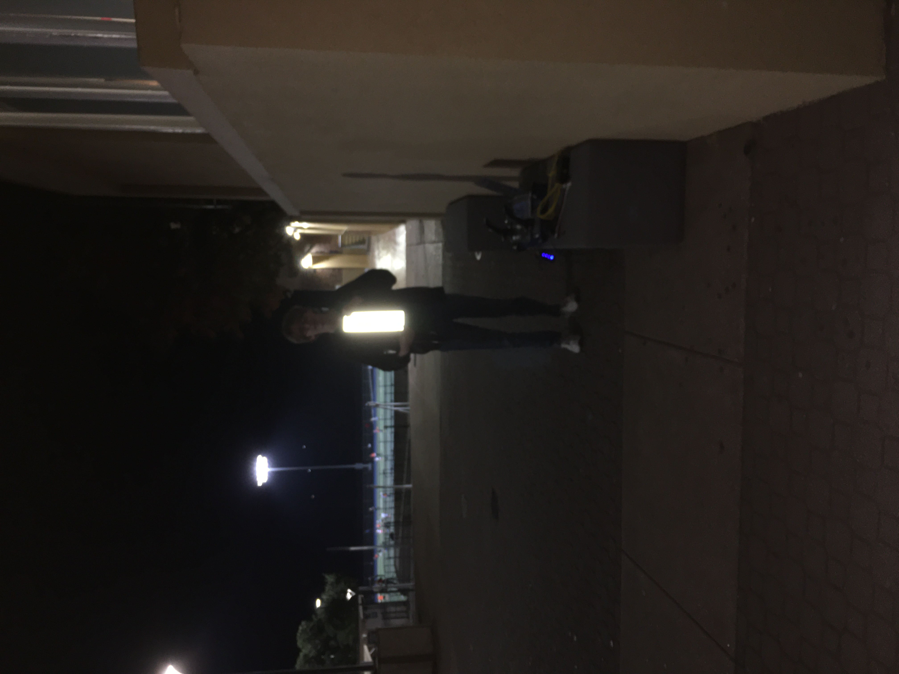

## What is a Limelight?
A [Limelight](https://andymark-weblinc.netdna-ssl.com/product_images/limelight-2-plus/5e15fe1480289d6162f285cd/zoom.jpg?c=1578499604) is a small, on-board computer and camera system that performs computer vision. Many FRC teams, including us, use a Limelight for the autonomous period of competition games. Limelights are expensive and should be handled carefully.

How does it work? Well, the principles are simple. Several places on the field are marked by special tape known as retroreflective vision tape. This tape reflects all light that hits it directly back at the source, as shown in the image below (the photo was taken with flash). The tape is the only visible object in the image because all the light from the flash was reflected by the vision tape right back at the camera.




The limelight shines green light continuously and captures images using a camera. If the limelight shines green light onto retroreflective vision tape, the tape will show up brightly in the camera image. The limelight then determines the brightest object in the image, draws bounding boxes around it, finds the center of the bounding box, and determines the difference between that center and the crosshair of the camera alongside other important variables.

Take a look at the instructions [here](https://docs.limelightvision.io/en/latest/getting_started.html) for setting up the Limelight. As well, you should read how to build and configure a vision pipeline [here](https://docs.limelightvision.io/en/latest/vision_pipeline_tuning.html).

There are two important interfaces for the limelight: http://limelight.local:5801 and http://limelight.local:5800 (you need to be connected to the limelight to use these links). The first one is for configuring the Limelight pipeline and the second one is for displaying the camera feed.

## Limelight NetworkTables values
[`NetworkTables`](https://first.wpi.edu/FRC/roborio/release/docs/java/edu/wpi/first/networktables/NetworkTable.html) might seem like a new concept, but you have already been working with `NetworkTables` because it includes `SmartDashboard` as one of its keys. Whenever you put or read values using SmartDashboard, you were working with `NetworkTables`. You can think of every instance of `SmartDashboard` as `NetworkTableInstance.getDefault().getTable("SmartDashboard")`. You can find a full description of `NetworkTables` [here](https://docs.wpilib.org/en/stable/docs/software/networktables/index.html?highlight=networktables),

Most important for this section is the fact that the Limelight puts many useful values to `NetworkTables`. You can find the full list [here](https://docs.limelightvision.io/en/latest/networktables_api.html), but I will highlight a few important ones:

Key | Description
----| -----------
`tv`  | A double (effectively a boolean) representing whether or not a vision target is in view.
`tx`  | The horizontal difference between the center of the vision target and the crosshair \(\text{target}_x - \text{crosshair}_x\).
`ty`  | The vertical difference between the center of the vision target and the crosshair \(\text{target}_y - \text{crosshair}_y\).
`ta`  | The percentage of area that the vision target takes up in the camera feed.
`ledMode` | The current mode of the LEDs on the limelight (0 for pipeline default, 1 for off, 2 for blink, 3 for on)
`tcornx` | An array representing the x-coordinates of the corners of the bounding box.
`tcorny` | An array representing the y-coordinates of the corners of the bounding box.

The code for accessing a key is:

``` Java
NetworkTableInstance.getDefault().getTable("limelight").getEntry("<variablename>").getDouble(0);
```

You may want to store the Limelight `NetworkTable` as a variable depending on how often you plan on accessing its entries.

## Distance Estimation and Angle Alignment
There are several "Case Studies" in the [Limelight documentation](https://docs.limelightvision.io/en/latest). I will highlight a few and compare/contrast with the Limelight code used for the 2020 Build Season. I highly recommend watching the gifs of the code in action for each of the case studies.

First up, aiming. Here is the featured code for aiming at a vision target (it is written in C++, but the math is the same regardless of the syntax):
``` Java
float Kp = -0.1f;
float min_command = 0.05f;

std::shared_ptr<NetworkTable> table = NetworkTable::GetTable("limelight");
float tx = table->GetNumber("tx");

if (joystick->GetRawButton(9))
{
        float heading_error = -tx;
        float steering_adjust = 0.0f;
        if (tx > 1.0)
        {
                steering_adjust = Kp*heading_error - min_command;
        }
        else if (tx < 1.0)
        {
                steering_adjust = Kp*heading_error + min_command;
        }
        left_command += steering_adjust;
        right_command -= steering_adjust;
}
```

The code is active while a specific button is pressed. It gets the current horizontal offset and uses that as the error for a PID loop with a setpoint of zero. The idea is that the robot will be "aligned" if the offset is near zero. Since the Limelight is fixed in place on the robot, the only way to control the horizontal crosshair offset is to turn left/right.

The second segment of code is for moving to a particular distance:

``` Java
float KpDistance = -0.1f;

std::shared_ptr<NetworkTable> table = NetworkTable::GetTable("limelight");
float distance_error = table->GetNumber("ty");

if (joystick->GetRawButton(9))
{
        driving_adjust = KpDistance * distance_error;

        left_command += distance_adjust;
        right_command += distance_adjust;
}
```

The idea here is the same as before: a PID loop with a setpoint at zero and a crosshair offset as the error. Since the Limelight is fixed in place on the robot, the only way to control the vertical crosshair offset is to move forward/backward. So, to set a particular distance, one would need to experiment with varying setpoints until the robot drives to the specified distance.

Now take a look at [Limelight.java](https://github.com/DeepBlueRobotics/RobotCode2020/blob/unifiedcode/src/main/java/org/team199/lib/Limelight.java) from RobotCode2020. In particular, take a look at [`distanceAssist()`](https://github.com/DeepBlueRobotics/RobotCode2020/blob/unifiedcode/src/main/java/org/team199/lib/Limelight.java#L111), [`steeringAssist()`](https://github.com/DeepBlueRobotics/RobotCode2020/blob/unifiedcode/src/main/java/org/team199/lib/Limelight.java#L127), and [`autoTarget()`](https://github.com/DeepBlueRobotics/RobotCode2020/blob/unifiedcode/src/main/java/org/team199/lib/Limelight.java#L172). Some things I will point about about the code, especially `steeringAssist()`, are:

1. We use the `PIDController` class which allows us the ability to use kP as well as kI and kD if we wish.

2. We use `ta` to determine if the bounding box is large enough to consider as a vision target.

3. When `steeringAssist()` does not see a bounding box, it turns in the direction of the last `tx` value. This is to make sure that if it overshoots or if the target changes direction, it will take the shortest path to try to face the target again.

The programming team had some fun with this code during the 2019-2020 Pre-Season:

<iframe width="560" height="315" src="https://www.youtube.com/embed/TjksUg227QQ" frameborder="0" allow="accelerometer; autoplay; encrypted-media; gyroscope; picture-in-picture" allowfullscreen></iframe>

<iframe width="560" height="315" src="https://www.youtube.com/embed/cFZtFT6d0g0" frameborder="0" allow="accelerometer; autoplay; encrypted-media; gyroscope; picture-in-picture" allowfullscreen></iframe>