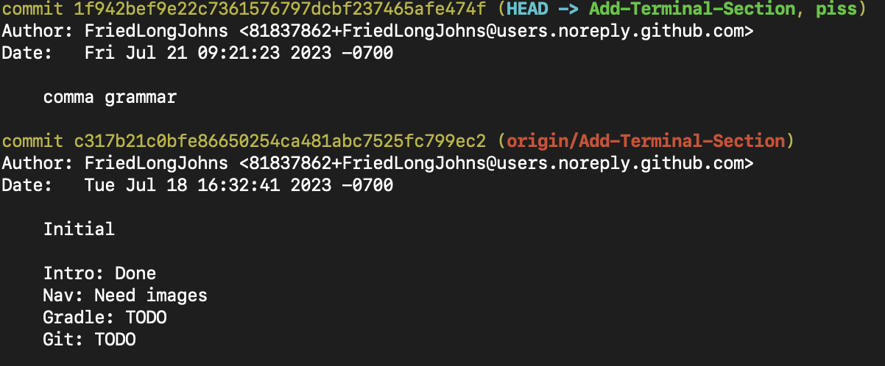

<style>sub{color:gray;}</style>
<style>green{color:#006600;}</style>
<style>red{color:#660000;}</style>
<style>big{font-size:20px;}</style>

# Oh No

Why are you using git in the terminal? Why not just use GitHub Desktop or VSCode's git window or something? Everything's the same!

...That's not quite true. Using git from the command line (another word for the terminal) gives you *just slightly* more control. Even then, it's not really worth it unless you have something super complex to do.

## Helping Git Help Yourself

Git is called from the terminal, simply, by typing `git`. ...But that only tells you what you can do. What is `rebase?` What is `merge`? Maybe you don't know. But that's where `git help` comes in. Let's say you want to know about `git rebase` - you type `git help rebase`.
```
Jim@Driverstation2 Downloads % git help rebase
```
You'll get quite a bit of stuff to look at - pick out what you can.

But oh no! Where's the normal screen! You can't leave! You can type "q" to leave.

And now that you can help yourself, we'll only be going over the commands in git, in order of necessity.

A complete list of what's in here:
```
git fetch
git pull
git push
git commit -a -m "title" -m "message"
git log
git revert (ID)
git branch
git branch (name)
git checkout (name)
git reset --hard (commit ID)
git push origin HEAD --force
```

## The usuals
<big> `git fetch` & `git pull` & `git push` </big>

No explanation needed. Fetch before pulling, as usual.
And do try and remember: Commit before you push, otherwise you're pushing nothing.

## Committing
<big> `git commit -a -m "Title" -m "Message"` </big>
Git commit is a bit longer than most of the others, but for good reason. Keep the double-quotes!
EX. use:
```
Jim@Driverstation2 RobotCode2023 % git commit -a -m "Added Constants" -m "Added overloadSocks, megaChad, and barfBottleCount to constants"
...
Jim@Driverstation2 RobotCode2023 % git commit -a -m "Deleted Drivetrain subsystem" -m "why not :)"
...
Jim@Driverstation2 RobotCode2023 % git push
```

## History & the undo command
<big> `git log` </big>
A funny way of looking at the commit history of your repo. Hit `q` to leave the history screen. Those big strings of garbage numbers and letters? We call those `commit ID`s.

Usually, this is used to make sure you did the right thing... but what if you didn't?

<big> `git revert (commit ID)` </big>

That's where revert comes in. It creates a new commit called a 'revert', which you can then push to the repo to undo your mistake.

EX:
Let's say I have these two commits in my `git log`


You can see here that the commit IDs are `1f942bef9e22c7361576797dcbf237465afe474f` for the latest one and `c317b21c0bfe86650254ca481abc7525fc799ec2` for my previous commit. We're assuming my latest commit is bad, and I need to undo it. 
```
Jim@Driverstation2 RobotCode2023 % git revert 1f942bef9e22c7361576797dcbf237465afe474f
[...]
```
That's it. Push the commit, and I'm done.

## Branches
<big> `git branch` & `git branch (name)` </big>

These show you which branch you're in, and allow you to create/delete a new branch if you specify a name.

```
Jim@Driverstation2 RobotCode2023 % git branch
  master
* dev
Jim@Driverstation2 RobotCode2023 % git branch wawa; git branch
  master
* dev
  wawa
Jim@Driverstation2 RobotCode2023 % git branch --delete wawa; git branch
Deleted branch wawa (was 1f942be).
  master
* dev
```
<sub>What did we do here? We created the branch `wawa`, and then deleted it right after. We keep using `git branch` to print the current branches available.</sub>

!!! note 
    Many things in git have to be done in a specific order. Remember that you can use the ; sign to separate multiple commands in the terminal.

!!! question
		Wait... but how do I swap branches?

<big> `git checkout (existing branch name)` </big>
	
Neat. Just remember you can't change branches if you have changes you didn't commit on your current branch.

```
Jim@Driverstation2 RobotCode2023 % git branch
  master
* dev
Jim@Driverstation2 RobotCode2023 % git checkout dev; git branch
  master
* dev
```

## Playing god
<big> `git reset --hard (commit ID)` & `git push origin HEAD --force` </big>

<sub><red>For people who want to change the flow of time itself.</red></sub>

Most people won't need to know this one. This is if you screwed up <red>real bad</red>. And this can also screw *everybody else* over if you don't know exactly what you're doing.

DO. NOT. USE. 

Unless you know **exactly** what you are doing. I mean it.

Okay, warning aside, this is how you change the history of a git repo. When you revert a change, you still are commiting to the repo. It's more junk on the history.

For example, let's say I have this history on the online repo.

`prev1 -> prev2 -> what other people have`

But what if I want to set the latest commit to `prev2` *without* adding an extra revert commit to the history? A revert will make the history look like option A here, but option B is what these two commands allow you to change it to.

```
A: revert prev1 -> prev1 -> prev2 -> what other people have
B:                          prev2 -> what other people have
```

In this case, you would do `git reset --hard (whatever the commit ID of prev2 is)`.

If I hadn't pushed my changes to the online repo, this would be fine. But since other people have the repo, you need to make sure the repo knows as well. Use `git push origin HEAD --force` to make the *online* repo's 'latest commit' the same as *your* repo's latest commit.

!!! warning
		If other people have already received your changes (in this case prev1 and prev2), then if they do not fetch the new changes in the history of the repo, when they try to commit a change, the histories will conflict and make everybody have to deal with the big sphagetti mess of history in the repo.

Takeaway: Tell others when you change history itself.