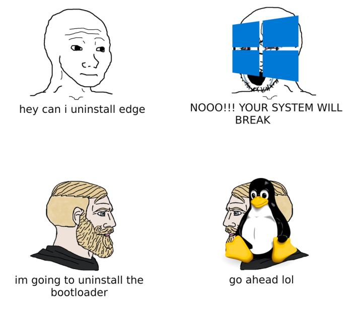

# The `Terminal`
*(Also known as the Big Scary Ugly Fancy Interactive Textbox)*

!!! question
    What's the terminal? Why would I use it?

The terminal is takes some time to learn. There's no getting around it. It looks like a big box of text and you can't use your mouse. But using it unlocks ✨*special abilities*✨ from any computer you're using.

- Building and Deploying the robot code *without* WPILib or any other software.
- Previewing this website as you edit it
- (ugly) Github!
- Browse files
- Installing anything you could think of
- **Un**installing your operating system and everything else

To put it shortly - you can do *anything* on your computer with the terminal, ... as long as you take the time to learn how.

What's covered in this section:

- [Almost] Everything mentioned above
***
This is why the driverstations are Windows computers and not Linux computers
> 