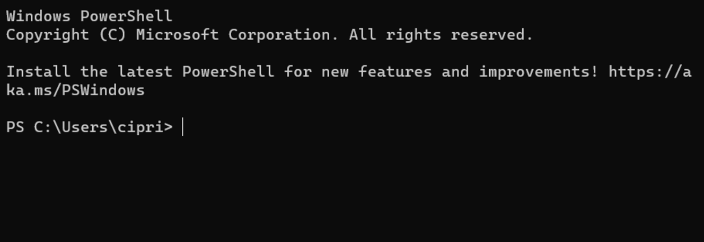
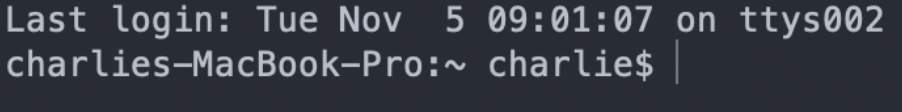

<style>sub{color:gray;}</style>
<style>green{color:#006600;}</style>

# Navigating this Barren Wasteland of Text



<sub>A Windows and a MacOS terminal</sub>

Your terminal might look a little different, depending where you are. It goes by many names: `Terminal`, `Console`, `PowerShell`, `Command Line`, etc. But no matter where you are, they're all the same if you type `bash` and hit enter.

### What did that just do?

Terminals are finicky beasts. They take in commands, a line at a time. No syntax highlighting, no git integration, none of the comfort of VSCode. `bash` happens to be a command which sets the terminal "language" to... bash. How surprising. 

The reason to do this is because not all terminals speak the same language - and the person who wrote page this happens to like using bash.

## Looking around

If you're new to your terminal, then you're blind right now. You've got no clue what happened, or where you are. But remember what you (should have) read earlier? Your terminal is, in one way or another, a file browser. But you can't see or move unless you know your commands.

!!! note 
    Move your cursor bar with the **left and right arrow keys**. The up and down arrow keys are for scrolling through your previous commands to easily re-use them.

### 1) `ls`

`ls` is a short version of what it does: `List the things I can see.` In your file browser you can, for example, see all of your things inside your `Downloads` folder when you double-click on it to get there. `ls` is the command that tells you what's there. But how do we "get there" in the terminal? How do we know where we are?

### 2) `pwd`

`pwd` is the command that tells you where you are. As an example, let's say I type `pwd` and hit enter, and I get this as a response:

`/users/Jim`

This tells me I'm in the `jim/` folder, which is in the `users` folder, and so on it might go until you hit the last `/`, which is the "root" folder of your entire computer. And that's cool and all, but I'd like to be in my `downloads` folder. I need to see what's in front of me.

`Jim@Driverstation2 Jim %`

<sub>Time to use `ls`!</sub>

`Jim@Driverstation2 Jim % ls`

<sub>And now we hit the enter key...</sub>

```
Jim@Driverstation2 Jim % ls
Applications	Downloads	Movies		Public		bin		opt
Desktop		Library		Music		Sites		eclipse   utmp.txt
Documents	LocalApps	Pictures	Templates	nltk_data
```

!!! note 
    When using `ls`, things that are not folders will have their extensions at the end of them, such as the `.txt` of `utmp.txt` in this scenario.

Abracadabra, we can see `Downloads` from here!

There's quite a lot of other things as well, but they don't matter... for now. For now, we need to "move" into that folder, which uses, you guessed it: another command!

### 3) `cd`

Unfortunately, `cd` does not stand for `go to`, unless you're pronouncing it as `coe - due` and pretending you said "go to". But you get the point, hopefully. `cd` is for "going" to locations. You type cd, put a space, and then the name of where you want to go.

`Jim@Driverstation2 Jim % cd Down`

<sub>Here's something that will save your time: You can type *most* of a file/folder name, and then hit tab to autocomplete the name! It will add the `/` symbol to the end of folders, so don't worry about that.</sub>

`Jim@Driverstation2 Jim % cd Downloads/`

`Jim@Driverstation2 Downloads %`

And look at that! The prompt text has changed, telling us we're in the `Downloads` folder instead of the `Jim` folder!

And if we run `pwd` to check where we are...
```
Jim@Driverstation2 Downloads % pwd
/Users/Jim/Downloads
```

!!! question
    But what if I want to go *backwards*?

You're in luck. The `cd` command has special keywords for doing things like that.

- `..`  "backwards", or rather the folder holding your current folder. However, you can't do this when you're in the `/` (AKA the "root") folder, since nothing contains that.
- `~`  Your "user" folder - this is the `/Users/Jim` we were at, since our imaginary computer person was named "Jim"
- `/`  The root directory of your computer. All the way back!

So `cd ..` will send you backwards, in our case from `/Users/Jim/Downloads` back into `/Users/Jim`

<green>And with that, you are fully able to use your terminal as an ugly, slow (but actually super fast when you get good) file browser.</green>

## One Final Thing

Surely, you noticed that we use the `/` symbol to separate folders in file paths, right?
And you know that we have special keyword folders in cd?

These are useful together... sometimes. And you need to know where you're going, of course.

### EX 1: Swapping folders

Let's say I want to go to a different github project than my current one.

Where am I? `~/Github/RobotCode2021`

Where do I want to be? `~/Github/RobotCode2076`

Instead of doing two separate commands to go back and then back into the other project, I can simply type `cd ../Robotcode2076`

### EX 2: Going backward faster

Maybe you're within a folder within a folder within a folder, and so forth. Typing `cd ../../../..` isn't very fun.

Where am I? `Users/Jim/Documents/Github/RobotCode2021/src/main/java/org/carlmontrobotics/robotcode2023/commands`

Where do I want to be? `~/Downloads/memes`

The answer is right there - `cd ~/Downloads/memes` instead of `cd ../../../../../../../../../../Downloads/memes`
***